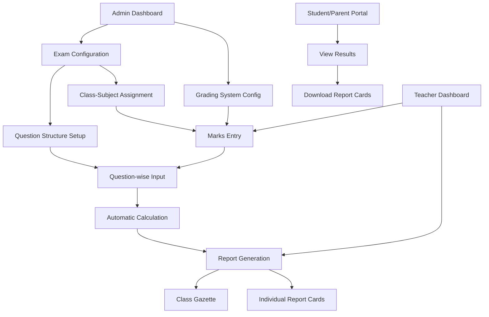

## 1. Product Overview
The Exam module provides a comprehensive examination management system for schools. It enables administrators to define grading systems and exam structures, allows teachers to input detailed marks per question, and generates various reports including gazettes and report cards.

The system supports both detailed term exams with per-question marking and simplified class tests with pass/fail tracking, ensuring flexible assessment approaches for different educational needs.

## 2. Core Features

### 2.1 User Roles
| Role | Registration Method | Core Permissions |
|------|---------------------|------------------|
| Admin | System administrator account | Configure grading systems, define exam structures, manage exam configurations |
| Teacher | School staff account | Input student marks per question, view class results, generate reports |
| Student | School enrollment | View personal results and report cards |
| Parent | Linked to student account | View child's results and progress reports |

### 2.2 Feature Module
Our exam module requirements consist of the following main pages:
1. **Grading System Configuration**: Define grade ranges, grade points, and color coding for different grading systems.
2. **Exam Configuration**: Set up exam details, define question structures with marks allocation, and assign to classes and subjects.
3. **Marks Entry**: Teacher interface for entering student marks per question with validation and status tracking.
4. **Results Gazette**: Class-wise result overview with subject breakdowns, percentages, and grades.
5. **Report Card Generator**: Individual student report cards with detailed subject performance and overall summary.
6. **Class Test Management**: Simplified assessment tracking with pass/fail status and basic statistics.

### 2.3 Page Details
| Page Name | Module Name | Feature description |
|-----------|-------------|---------------------|
| Grading System Configuration | Grade System Setup | Create and manage grading systems with custom grade ranges, minimum/maximum percentages, grade points, and color coding. Assign grading systems to class groups. |
| Grading System Configuration | Grade Range Definition | Define individual grade ranges (A+, A, B+, etc.) with specific percentage brackets and corresponding grade points for GPA calculation. |
| Exam Configuration | Exam Creation | Create new exams with name, type (Term/Class Test), date range, academic year, and school assignment. |
| Exam Configuration | Subject-Question Structure | Define question-wise breakdown for each subject including question labels, maximum marks, and ordering. Set pass marks and total maximum marks. |
| Exam Configuration | Class-Subject Assignment | Assign exam configurations to specific classes and subjects with customized mark structures for each combination. |
| Marks Entry | Student Selection | Select class, subject, and exam to view enrolled students with their admission numbers and names. |
| Marks Entry | Question-wise Marks Input | Enter obtained marks for each question per student with real-time validation against maximum marks. Display running total and pass/fail status. |
| Marks Entry | Bulk Operations | Support for bulk marks entry, import/export functionality, and quick status updates for multiple students. |
| Results Gazette | Class Overview | Display class-wise results in tabular format showing all students with their subject-wise marks, totals, percentages, and grades. |
| Results Gazette | Subject Breakdown | Show detailed subject performance with individual question marks, obtained totals, and calculated grades based on grading system. |
| Results Gazette | Export & Print | Generate printable gazettes and export results in PDF format with school branding and official formatting. |
| Report Card Generator | Individual Report Card | Create personalized report cards with student information, subject-wise performance, overall summary, grades, and teacher/principal signatures. |
| Report Card Generator | Academic History | Include previous exam results and progress tracking with grade improvement indicators. |
| Class Test Management | Simple Assessment Entry | Quick entry interface for class tests with only total obtained marks and pass/fail status. |
| Class Test Management | Basic Statistics | Display class performance statistics including pass percentage, average marks, and top performers. |

## 3. Core Process

### Admin Flow
1. **Grading System Setup**: Navigate to grading configuration → Create new grading system → Define grade ranges with percentages and grade points → Assign to class groups.
2. **Exam Structure Definition**: Create exam → Set exam type and dates → Configure question structure for each subject → Assign to classes → Define maximum and pass marks.

### Teacher Flow
1. **Marks Entry**: Select exam and subject → View student list → Enter question-wise marks for each student → System calculates totals and determines pass/fail status → Save and validate entries.
2. **Report Generation**: Access results section → Select class and exam → View automatic calculations → Generate gazette for class overview → Print individual report cards for students.

### Student/Parent Flow
1. **Result Viewing**: Access student portal → View exam results → Download/print report cards → Track academic progress across multiple exams.

## 4. User Interface Design

### 4.1 Design Style
- **Primary Colors**: Professional blue (#2563eb) for primary actions, green (#16a34a) for success states, red (#dc2626) for failures
- **Secondary Colors**: Gray scale for neutral elements, amber for warnings
- **Button Style**: Rounded corners with subtle shadows, clear hover states
- **Typography**: Clean sans-serif fonts (Inter), 14px base size with proper hierarchy
- **Layout**: Card-based design with clear sections, responsive tables with sticky headers
- **Icons**: Consistent icon set for actions (pencil for edit, printer for print, download for export)

### 4.2 Page Design Overview
| Page Name | Module Name | UI Elements |
|-----------|-------------|-------------|
| Grading System Configuration | Grade System Setup | Clean form with color-coded grade ranges, drag-and-drop reordering, live preview of grading scale |
| Exam Configuration | Question Structure | Dynamic form builder for adding/removing questions, mark allocation inputs, total calculation display |
| Marks Entry | Student List | Searchable student table with quick filters, color-coded pass/fail status, validation feedback |
| Results Gazette | Results Table | Responsive table with sticky headers, sortable columns, color-coded grades, print-optimized layout |
| Report Card | Individual Card | Professional certificate layout with school header, student photo placeholder, signature sections |

### 4.3 Responsiveness
Desktop-first design approach with mobile adaptation. Primary interface optimized for desktop use due to complex data entry requirements. Mobile views focus on result viewing and basic navigation with simplified layouts.

### 4.4 Accessibility
Keyboard navigation support, proper ARIA labels, high contrast mode compatibility, screen reader friendly tables with proper headers and descriptions.