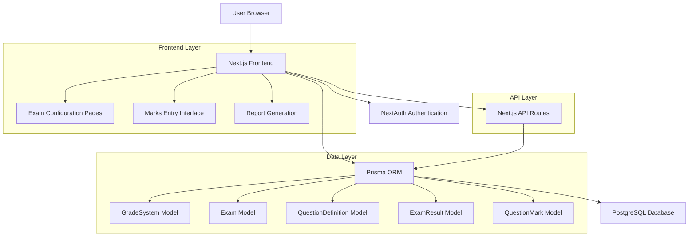
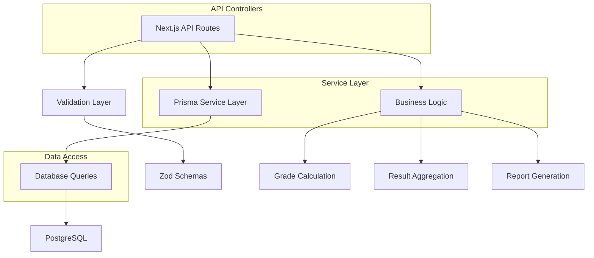

## 1. Architecture Design



## 2. Technology Description
- **Frontend**: Next.js 14 + React 18 + TypeScript + Tailwind CSS
- **Database**: PostgreSQL with Prisma ORM
- **Authentication**: NextAuth.js
- **UI Components**: Custom component library (shadcn/ui based)
- **Styling**: Tailwind CSS with custom design system
- **State Management**: React hooks and context
- **Data Validation**: Zod schemas for form validation

## 3. Route Definitions
| Route | Purpose |
|-------|---------|
| /exams/grading-systems | Manage grading systems and grade ranges |
| /exams/configure | Create and configure exams with question structures |
| /exams/marks-entry | Teacher interface for entering student marks |
| /exams/results/gazette | Class-wise results overview and gazette generation |
| /exams/results/report-card | Individual student report card generation |
| /api/exams/grading-systems | CRUD operations for grading systems |
| /api/exams/configurations | Exam and question configuration management |
| /api/exams/marks | Marks entry and validation endpoints |
| /api/exams/results | Results calculation and retrieval |
| /api/exams/reports | Report generation and export functionality |

## 4. API Definitions

### 4.1 Grading System APIs

**Create Grading System**
```
POST /api/exams/grading-systems
```

Request:
```json
{
  "name": "Standard High School",
  "description": "Traditional A-F grading system",
  "schoolId": "school_123",
  "ranges": [
    {
      "name": "A+",
      "minPercent": 90,
      "maxPercent": 100,
      "gradePoint": 4.0,
      "color": "#10b981"
    },
    {
      "name": "A",
      "minPercent": 80,
      "maxPercent": 89,
      "gradePoint": 3.7,
      "color": "#22c55e"
    }
  ]
}
```

Response:
```json
{
  "id": "grade_system_123",
  "name": "Standard High School",
  "schoolId": "school_123",
  "createdAt": "2024-01-01T00:00:00Z"
}
```

### 4.2 Exam Configuration APIs

**Create Exam Configuration**
```
POST /api/exams/configurations
```

Request:
```json
{
  "examId": "exam_123",
  "subjectId": "subject_456",
  "classId": "class_789",
  "maxMarks": 100,
  "passMarks": 40,
  "questions": [
    {
      "label": "Q1 - Multiple Choice",
      "maxMarks": 20,
      "order": 1
    },
    {
      "label": "Q2 - Short Answers",
      "maxMarks": 30,
      "order": 2
    },
    {
      "label": "Q3 - Essay Questions",
      "maxMarks": 50,
      "order": 3
    }
  ]
}
```

### 4.3 Marks Entry APIs

**Submit Student Marks**
```
POST /api/exams/marks
```

Request:
```json
{
  "examId": "exam_123",
  "studentId": "student_456",
  "subjectId": "subject_789",
  "questionMarks": [
    {
      "questionDefId": "q1_123",
      "obtainedMarks": 18
    },
    {
      "questionDefId": "q2_123",
      "obtainedMarks": 25
    },
    {
      "questionDefId": "q3_123",
      "obtainedMarks": 40
    }
  ]
}
```

Response:
```json
{
  "examResultId": "result_123",
  "totalObtained": 83,
  "totalMax": 100,
  "percentage": 83,
  "status": "PASS",
  "grade": "A"
}
```

### 4.4 Results APIs

**Get Class Results**
```
GET /api/exams/results?examId=exam_123&classId=class_456
```

Response:
```json
{
  "examName": "First Term Examination",
  "className": "Class 10-A",
  "students": [
    {
      "studentId": "student_123",
      "studentName": "John Doe",
      "admissionNo": "A001",
      "subjects": [
        {
          "subjectName": "Mathematics",
          "obtained": 85,
          "maxMarks": 100,
          "status": "PASS",
          "grade": "A"
        }
      ],
      "summary": {
        "totalObtained": 425,
        "totalMax": 500,
        "percentage": 85,
        "grade": "A"
      }
    }
  ]
}
```

## 5. Server Architecture Diagram



## 6. Data Model

### 6.1 Data Model Definition

```mermaid
erDiagram
    GradeSystem ||--o{ GradeRange : contains
    GradeSystem ||--o{ ClassGroup : assigned_to
    Exam ||--o{ ExamConfiguration : has_configurations
    ExamConfiguration ||--o{ QuestionDefinition : defines_questions
    ExamConfiguration ||--o{ ExamResult : produces_results
    ExamResult ||--o{ QuestionMark : contains_marks
    QuestionDefinition ||--o{ QuestionMark : referenced_by
    Student ||--o{ ExamResult : has_results
    Subject ||--o{ ExamConfiguration : configured_for
    Class ||--o{ ExamConfiguration : applies_to

    GradeSystem {
        string id PK
        string name
        string description
        string schoolId FK
        datetime createdAt
        datetime updatedAt
    }

    GradeRange {
        string id PK
        string name
        float minPercent
        float maxPercent
        float gradePoint
        string color
        string gradeSystemId FK
    }

    Exam {
        string id PK
        string name
        string type
        datetime startDate
        datetime endDate
        string academicYearId FK
        string schoolId FK
        datetime createdAt
        datetime updatedAt
    }

    ExamConfiguration {
        string id PK
        float maxMarks
        float passMarks
        string examId FK
        string subjectId FK
        string classId FK
        datetime createdAt
        datetime updatedAt
    }

    QuestionDefinition {
        string id PK
        string label
        float maxMarks
        int order
        string examConfigId FK
        datetime createdAt
        datetime updatedAt
    }

    ExamResult {
        string id PK
        float marksObtained
        string status
        string examId FK
        string studentId FK
        string subjectId FK
        string classId FK
        datetime createdAt
        datetime updatedAt
    }

    QuestionMark {
        string id PK
        float obtainedMarks
        string examResultId FK
        string questionDefId FK
        datetime createdAt
        datetime updatedAt
    }
```

### 6.2 Data Definition Language

**GradeSystem Table**
```sql
CREATE TABLE grade_systems (
    id TEXT PRIMARY KEY DEFAULT gen_random_uuid(),
    name VARCHAR(255) NOT NULL,
    description TEXT,
    school_id TEXT NOT NULL REFERENCES schools(id) ON DELETE CASCADE,
    created_at TIMESTAMP WITH TIME ZONE DEFAULT NOW(),
    updated_at TIMESTAMP WITH TIME ZONE DEFAULT NOW()
);

CREATE INDEX idx_grade_systems_school_id ON grade_systems(school_id);
```

**GradeRange Table**
```sql
CREATE TABLE grade_ranges (
    id TEXT PRIMARY KEY DEFAULT gen_random_uuid(),
    name VARCHAR(10) NOT NULL,
    min_percent FLOAT NOT NULL,
    max_percent FLOAT NOT NULL,
    grade_point FLOAT NOT NULL,
    color VARCHAR(7),
    grade_system_id TEXT NOT NULL REFERENCES grade_systems(id) ON DELETE CASCADE,
    created_at TIMESTAMP WITH TIME ZONE DEFAULT NOW(),
    updated_at TIMESTAMP WITH TIME ZONE DEFAULT NOW()
);

CREATE INDEX idx_grade_ranges_system_id ON grade_ranges(grade_system_id);
```

**ExamConfiguration Table**
```sql
CREATE TABLE exam_configurations (
    id TEXT PRIMARY KEY DEFAULT gen_random_uuid(),
    max_marks FLOAT NOT NULL DEFAULT 100,
    pass_marks FLOAT NOT NULL DEFAULT 40,
    exam_id TEXT NOT NULL REFERENCES exams(id) ON DELETE CASCADE,
    subject_id TEXT NOT NULL REFERENCES subjects(id) ON DELETE CASCADE,
    class_id TEXT NOT NULL REFERENCES classes(id) ON DELETE CASCADE,
    created_at TIMESTAMP WITH TIME ZONE DEFAULT NOW(),
    updated_at TIMESTAMP WITH TIME ZONE DEFAULT NOW(),
    UNIQUE(exam_id, subject_id, class_id)
);

CREATE INDEX idx_exam_config_exam_id ON exam_configurations(exam_id);
CREATE INDEX idx_exam_config_class_id ON exam_configurations(class_id);
```

**QuestionDefinition Table**
```sql
CREATE TABLE question_definitions (
    id TEXT PRIMARY KEY DEFAULT gen_random_uuid(),
    label VARCHAR(255) NOT NULL,
    max_marks FLOAT NOT NULL,
    "order" INTEGER NOT NULL DEFAULT 0,
    exam_config_id TEXT NOT NULL REFERENCES exam_configurations(id) ON DELETE CASCADE,
    created_at TIMESTAMP WITH TIME ZONE DEFAULT NOW(),
    updated_at TIMESTAMP WITH TIME ZONE DEFAULT NOW()
);

CREATE INDEX idx_question_def_exam_config_id ON question_definitions(exam_config_id);
```

**ExamResult Table**
```sql
CREATE TABLE exam_results (
    id TEXT PRIMARY KEY DEFAULT gen_random_uuid(),
    marks_obtained FLOAT NOT NULL,
    status VARCHAR(10),
    exam_id TEXT NOT NULL REFERENCES exams(id) ON DELETE CASCADE,
    student_id TEXT NOT NULL REFERENCES users(id) ON DELETE CASCADE,
    subject_id TEXT NOT NULL REFERENCES subjects(id) ON DELETE CASCADE,
    class_id TEXT NOT NULL REFERENCES classes(id) ON DELETE CASCADE,
    created_at TIMESTAMP WITH TIME ZONE DEFAULT NOW(),
    updated_at TIMESTAMP WITH TIME ZONE DEFAULT NOW(),
    UNIQUE(exam_id, student_id, subject_id)
);

CREATE INDEX idx_exam_result_exam_id ON exam_results(exam_id);
CREATE INDEX idx_exam_result_student_id ON exam_results(student_id);
CREATE INDEX idx_exam_result_class_id ON exam_results(class_id);
```

**QuestionMark Table**
```sql
CREATE TABLE question_marks (
    id TEXT PRIMARY KEY DEFAULT gen_random_uuid(),
    obtained_marks FLOAT NOT NULL,
    exam_result_id TEXT NOT NULL REFERENCES exam_results(id) ON DELETE CASCADE,
    question_def_id TEXT NOT NULL REFERENCES question_definitions(id) ON DELETE CASCADE,
    created_at TIMESTAMP WITH TIME ZONE DEFAULT NOW(),
    updated_at TIMESTAMP WITH TIME ZONE DEFAULT NOW(),
    UNIQUE(exam_result_id, question_def_id)
);

CREATE INDEX idx_question_mark_result_id ON question_marks(exam_result_id);
CREATE INDEX idx_question_mark_def_id ON question_marks(question_def_id);
```