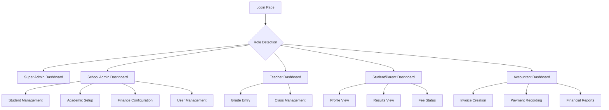

## 1. Product Overview

School Management System (SMS) is a comprehensive multi-tenant SaaS platform that enables educational institutions to manage their entire academic lifecycle digitally. The system handles student admissions, class management, examination grading, fee collection, and timetable scheduling in a single integrated solution.

This modern rewrite addresses scalability issues from legacy PHP/Laravel systems by implementing a type-safe, high-performance React/Node.js architecture with PostgreSQL database.

## 2. Core Features

### 2.1 User Roles

| Role | Registration Method | Core Permissions |
|------|---------------------|------------------|
| Super Admin | System pre-configured | Full system access, multi-school management |
| School Admin | School invitation/registration | School-wide management, user creation, system configuration |
| Teacher | School admin assignment | Class management, grade entry, timetable viewing |
| Student | School admin registration | View own records, grades, timetable, fee status |
| Parent | Linked to student accounts | View children's records, grades, fee payments |
| Accountant | School admin assignment | Fee management, invoice creation, payment tracking |

### 2.2 Feature Module

The School Management System consists of the following main pages:

1. **Dashboard**: Overview of school statistics, recent activities, and quick actions
2. **Student Management**: Student profiles, admissions, academic records, and promotions
3. **Academic Management**: Classes, subjects, timetable scheduling, and curriculum planning
4. **Examination System**: Exam creation, grade entry, report cards, and performance analytics
5. **Finance Module**: Fee structures, invoice generation, payment tracking, and financial reports
6. **User Management**: Staff administration, role assignments, and access control
7. **Multi-Campus Support**: Campus configuration and inter-campus data management
8. **Reports & Analytics**: Academic performance, financial summaries, and administrative reports

### 2.3 Page Details

| Page Name | Module Name | Feature description |
|-----------|-------------|---------------------|
| Dashboard | Overview Cards | Display key metrics (total students, teachers, pending fees, upcoming exams) with real-time updates |
| Dashboard | Quick Actions | Provide shortcuts to common tasks (admit student, create invoice, schedule exam) |
| Dashboard | Recent Activity | Show system-wide recent activities and notifications |
| Student Management | Student List | Display searchable, filterable list of all students with export options |
| Student Management | Student Profile | Show complete student information including personal details, academic history, grades, and fee status |
| Student Management | Admission Form | Multi-step form for new student admission with document upload and parent information |
| Student Management | Promotion System | Bulk promote students to next academic year with pass/fail criteria validation |
| Academic Management | Class Configuration | Create and manage classes, sections, and assign class teachers |
| Academic Management | Subject Assignment | Map subjects to classes and assign subject teachers |
| Academic Management | Timetable Builder | Drag-and-drop interface for creating class schedules with conflict detection |
| Examination System | Exam Creation | Set up exam types, dates, and grading criteria for different terms |
| Examination System | Grade Entry | Subject-wise marks entry with validation and grade calculation |
| Examination System | Report Cards | Generate printable report cards with grades, attendance, and teacher comments |
| Finance Module | Fee Structure | Create fee categories and assign fees to specific classes or students |
| Finance Module | Invoice Generation | Create individual or bulk invoices with payment deadlines and penalties |
| Finance Module | Payment Tracking | Record payments, generate receipts, and track outstanding amounts |
| User Management | Staff Directory | Manage teacher and staff profiles with qualification and experience details |
| User Management | Role Assignment | Assign and modify user roles with granular permission controls |
| Multi-Campus | Campus Setup | Configure multiple campuses under single school management |
| Multi-Campus | Campus Assignment | Assign students, teachers, and resources to specific campuses |
| Reports | Academic Reports | Generate performance reports by class, subject, or individual student |
| Reports | Financial Reports | Create fee collection summaries, outstanding reports, and revenue analysis |

## 3. Core Process

### Super Admin Flow
1. Login to system with super admin credentials
2. Create new school accounts with unique subdomains
3. Configure system-wide settings and modules
4. Monitor multi-school analytics and usage statistics
5. Manage global user accounts and permissions

### School Admin Flow
1. Register school account or accept invitation
2. Configure basic school information and branding
3. Set up academic years, terms, and grading systems
4. Create campus structures (if multi-campus)
5. Add teachers and assign subjects/classes
6. Configure fee structures and payment categories
7. Admit students and assign to appropriate classes
8. Monitor overall school performance and finances

### Teacher Flow
1. Login with teacher credentials
2. View assigned classes and subjects
3. Access student lists for assigned classes
4. Enter marks for examinations and assignments
5. View and print class timetables
6. Generate student progress reports

### Student/Parent Flow
1. Login with provided credentials
2. View personal/academic profile information
3. Access timetable and examination schedules
4. View grades and academic performance
5. Check fee status and payment history
6. Download report cards and certificates

### Accountant Flow
1. Login with accountant role
2. Access fee management dashboard
3. Create and manage fee invoices
4. Record payments and generate receipts
5. Track outstanding payments and send reminders
6. Generate financial reports and summaries



## 4. User Interface Design

### 4.1 Design Style

**Color Scheme:**
- Primary: Blue (#3B82F6) - Professional and trustworthy
- Secondary: Green (#10B981) - Success and positive actions
- Accent: Orange (#F59E0B) - Important notifications and CTAs
- Neutral: Gray palette for backgrounds and secondary elements

**Typography:**
- Headings: Inter font family, sizes 32px, 24px, 20px, 18px
- Body text: Inter font family, 16px regular, 14px for secondary information
- Monospace: Used for admission numbers and codes

**Component Style:**
- Buttons: Rounded corners (8px radius), clear hover states
- Cards: Subtle shadows, 12px border radius
- Forms: Clean input fields with proper validation feedback
- Tables: Striped rows, sortable headers, action buttons

**Icons:**
- Heroicons for consistent iconography
- Color-coded status indicators (green/red/amber)
- Educational-themed illustrations for empty states

### 4.2 Page Design Overview

| Page Name | Module Name | UI Elements |
|-----------|-------------|-------------|
| Dashboard | Overview Cards | Grid layout with metric cards showing key statistics, trend indicators, and sparkline charts |
| Dashboard | Quick Actions | Icon-based action buttons with descriptive labels, organized by category |
| Student List | Data Table | Searchable table with filters, pagination, bulk actions, and export functionality |
| Student Profile | Information Cards | Tabbed interface separating personal, academic, and financial information |
| Admission Form | Multi-step Form | Progress indicator, form validation, file upload with preview, parent/guardian section |
| Class Management | Interactive Grid | Card-based class display with section breakdown, teacher assignments |
| Timetable | Schedule Grid | Time-slot based grid with drag-and-drop functionality, color-coded subjects |
| Grade Entry | Marks Table | Spreadsheet-like interface with validation, auto-calculation, and bulk save |
| Fee Invoice | Invoice Builder | Itemized fee structure, payment terms, student information, total calculation |
| Reports | Chart Dashboard | Interactive charts, filterable data ranges, export to PDF/Excel options |

### 4.3 Responsiveness

**Desktop-First Design Approach:**
- Primary interface optimized for 1440px and above
- Collapsible sidebar navigation for screen space optimization
- Multi-column layouts for data-heavy pages

**Mobile Adaptation:**
- Responsive breakpoints at 1024px, 768px, and 640px
- Touch-optimized interface elements (48px minimum touch targets)
- Simplified mobile navigation with bottom tab bar
- Card-based layouts for mobile viewing
- Swipe gestures for navigation between sections

**Tablet Optimization:**
- Hybrid approach combining desktop efficiency with mobile simplicity
- Adaptive sidebar that transforms to overlay on smaller screens
- Optimized form layouts for touch input
- Landscape and portrait orientation support
\n+## 5. Technical Specification
\n+### 5.1 Technology Stack
- Framework: Next.js 14+ (App Router)
- Language: TypeScript (strict mode)
- Database: PostgreSQL
- ORM: Prisma Client
- Auth: NextAuth.js v5 with RBAC
- UI: Tailwind CSS + Shadcn UI
- Forms: React Hook Form + Zod
- State: Server Actions + React Query
\n+### 5.2 System Architecture
- Multi-tenancy via discriminator column `schoolId` on all major entities
- Security: All queries filter by `schoolId` from session; Super Admin bypasses for global views
- Campus hierarchy: School → Campus → Section → Student; curriculum shared across campuses
\n+## 6. Database Schema (Prisma)
\n+```prisma
generator client {
  provider = "prisma-client-js"
}

datasource db {
  provider = "postgresql"
  url      = env("DATABASE_URL")
}

enum Role {
  SUPER_ADMIN
  ADMIN
  TEACHER
  STUDENT
  PARENT
  ACCOUNTANT
}

model School {
  id            String   @id @default(cuid())
  name          String
  code          String   @unique
  logoUrl       String?
  address       String?
  phone         String?
  currentTermId String?
  campuses      Campus[]
  users         User[]
  academicYears AcademicYear[]
  classes       MyClass[]
  createdAt     DateTime @default(now())
}

model Campus {
  id        String  @id @default(cuid())
  name      String
  schoolId  String
  school    School  @relation(fields: [schoolId], references: [id])
  sections  Section[]
  students  StudentRecord[]
}

model AcademicYear {
  id        String   @id @default(cuid())
  name      String
  startDate DateTime
  endDate   DateTime
  schoolId  String
  school    School   @relation(fields: [schoolId], references: [id])
  semesters Semester[]
  students  AcademicYearStudent[]
}

model Semester {
  id             String       @id @default(cuid())
  name           String
  academicYearId String
  academicYear   AcademicYear @relation(fields: [academicYearId], references: [id])
  exams          Exam[]
  timetables     Timetable[]
}

model ClassGroup {
  id          String    @id @default(cuid())
  name        String
  description String?
  schoolId    String
  classes     MyClass[]
}

model MyClass {
  id           String     @id @default(cuid())
  name         String
  classGroupId String
  classGroup   ClassGroup @relation(fields: [classGroupId], references: [id])
  schoolId     String
  sections     Section[]
  subjects     Subject[]
}

model Section {
  id       String  @id @default(cuid())
  name     String
  classId  String
  myClass  MyClass @relation(fields: [classId], references: [id])
  campusId String
  campus   Campus  @relation(fields: [campusId], references: [id])
  students StudentRecord[]
}

model SubjectGroup {
  id       String  @id @default(cuid())
  name     String
  schoolId String
  subjects Subject[]
}

model Subject {
  id             String        @id @default(cuid())
  name           String
  code           String?
  classId        String
  myClass        MyClass       @relation(fields: [classId], references: [id])
  subjectGroupId String?
  subjectGroup   SubjectGroup? @relation(fields: [subjectGroupId], references: [id])
  teachers       TeacherSubject[]
  examRecords    ExamRecord[]
}

model User {
  id       String  @id @default(cuid())
  name     String
  email    String? @unique
  phone    String?
  password String
  role     Role    @default(STUDENT)
  schoolId String
  school   School  @relation(fields: [schoolId], references: [id])
  studentRecord StudentRecord?
  teacherRecord TeacherRecord?
  parentRecord  ParentRecord?
}

model StudentRecord {
  id            String  @id @default(cuid())
  userId        String  @unique
  user          User    @relation(fields: [userId], references: [id])
  admissionNo   String
  admissionDate DateTime
  campusId      String
  campus        Campus  @relation(fields: [campusId], references: [id])
  sectionId     String
  section       Section @relation(fields: [sectionId], references: [id])
  isGraduated   Boolean @default(false)
}

model TeacherRecord {
  id       String           @id @default(cuid())
  userId   String           @unique
  user     User             @relation(fields: [userId], references: [id])
  subjects TeacherSubject[]
}

model TeacherSubject {
  teacherId String
  teacher   TeacherRecord @relation(fields: [teacherId], references: [id])
  subjectId String
  subject   Subject       @relation(fields: [subjectId], references: [id])
  @@id([teacherId, subjectId])
}

model ParentRecord {
  id     String @id @default(cuid())
  userId String @unique
  user   User   @relation(fields: [userId], references: [id])
  children StudentParent[]
}

model StudentParent {
  studentId String
  parentId  String
  relation  String
  parent    ParentRecord @relation(fields: [parentId], references: [id])
  @@id([studentId, parentId])
}

model Exam {
  id         String   @id @default(cuid())
  name       String
  semesterId String
  semester   Semester @relation(fields: [semesterId], references: [id])
  startDate  DateTime
  endDate    DateTime
  slots      ExamSlot[]
}

model ExamSlot {
  id         String  @id @default(cuid())
  name       String
  totalMarks Int
  examId     String
  exam       Exam    @relation(fields: [examId], references: [id])
  records    ExamRecord[]
}

model ExamRecord {
  id            String   @id @default(cuid())
  marksObtained Float
  studentId     String
  subjectId     String
  examSlotId    String
  student       User     @relation(fields: [studentId], references: [id])
  subject       Subject  @relation(fields: [subjectId], references: [id])
  examSlot      ExamSlot @relation(fields: [examSlotId], references: [id])
  @@unique([studentId, subjectId, examSlotId])
}

model GradeSystem {
  id           String  @id @default(cuid())
  name         String
  minScore     Int
  maxScore     Int
  remark       String?
  classGroupId String
}

model FeeCategory {
  id       String @id @default(cuid())
  name     String
  schoolId String
  fees     Fee[]
}

model Fee {
  id            String      @id @default(cuid())
  name          String
  amount        Decimal
  feeCategoryId String
  feeCategory   FeeCategory @relation(fields: [feeCategoryId], references: [id])
}

model Invoice {
  id        String        @id @default(cuid())
  studentId String
  student   User          @relation(fields: [studentId], references: [id])
  dueDate   DateTime
  status    InvoiceStatus @default(UNPAID)
  items     InvoiceItem[]
}

enum InvoiceStatus {
  UNPAID
  PARTIAL
  PAID
}

model InvoiceItem {
  id        String  @id @default(cuid())
  invoiceId String
  invoice   Invoice @relation(fields: [invoiceId], references: [id])
  feeId     String
  amount    Decimal
}
```

## 7. Business Logic

### 7.1 Grading Algorithm
- Aggregate `ExamRecord` by student+subject across exam slots
- Percentage = `(sum(marksObtained) / sum(totalMarks)) * 100`
- Resolve `GradeSystem` via the student's `ClassGroup` and map percentage to grade range
- Use Prisma `groupBy` or SQL view for performance

### 7.2 Student Promotion
- End-of-year process validates pass criteria for core subjects
- Archive state in `AcademicYearStudent`
- Update `StudentRecord.sectionId` to next class/section
- If final class, set `StudentRecord.isGraduated = true`

### 7.3 Timetable Polymorphism
- Time slot references either `subjectId` or `customItemId` (nullable FKs)
- Render Subject Card if `subjectId` exists, else render Activity Card

## 8. Application Structure (Next.js App Router)

```
/app
  /api
  /(auth)
    /login
    /register
  /(dashboard)
    layout.tsx
    /admin
      /users
      /settings
    /academics
      /classes
      /subjects
      /timetables
    /students
      page.tsx
      [id]/page.tsx
    /finance
      /fees
      /invoices
/components
  /ui
  /forms
  /datatable
/lib
  /actions
    student.ts
    exam.ts
  /dal
    student.ts
  prisma.ts
  utils.ts
```

## 9. Developer Guidelines
- Update `schema.prisma` and run `npx prisma db push` for schema changes
- Implement server actions in `/lib/actions` with Zod validation and `revalidatePath`
- Use server components for data fetching; client components for interactive forms
- Always enforce session checks and `where: { schoolId: session.schoolId }` in queries
- Migrate legacy logic (e.g., grading) to `/lib/utils`

## 10. Deployment Strategy
- Host on Vercel or Docker (ECS/DigitalOcean)
- Database on a managed PostgreSQL (Neon, Supabase, AWS RDS)
- CI/CD via GitHub Actions: run ESLint, TypeCheck, and Build before merge
